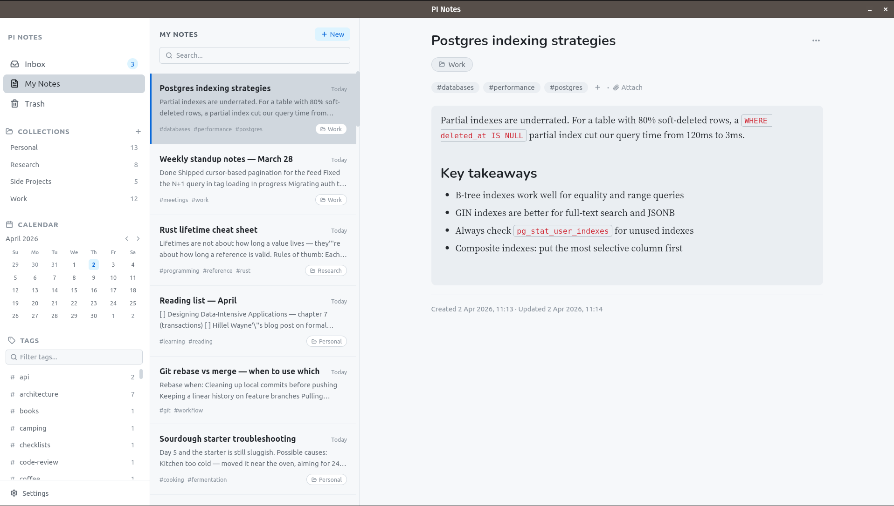

# PI Notes

A minimal local-first note-taking app.

This app is a result of me trying to learn more about coding agents and agentic engineering practices.



## Features

- Notes and attachments live in a single SQLite database
- Live markdown editor
- Tags, attachments, and note-to-note linking via `[[`
- Collections for organizing notes into groups
- `/date` command to link a note to a specific date, with a calendar view showing which days have notes

## Development

**Prerequisites (Linux)**

```bash
sudo apt-get install -y libwebkit2gtk-4.1-dev libgtk-3-dev \
  libayatana-appindicator3-dev librsvg2-dev libssl-dev
```

```bash
npm install
npm run dev
```

## Build

```bash
npm run build
```

Outputs `.deb`, `.rpm`, and `.AppImage` to `src-tauri/target/release/bundle/`.

## Disclaimer

Release artifacts are signed to verify authenticity and integrity. This does not constitute a warranty or guarantee of fitness, security, or support.

PI Notes stores all data locally on your device. You are responsible for backing up your database. The authors are not liable for data loss.

## Roadmap
- Internationalization
- Sync across devices
- Mobile apps
- Better filtering and search
